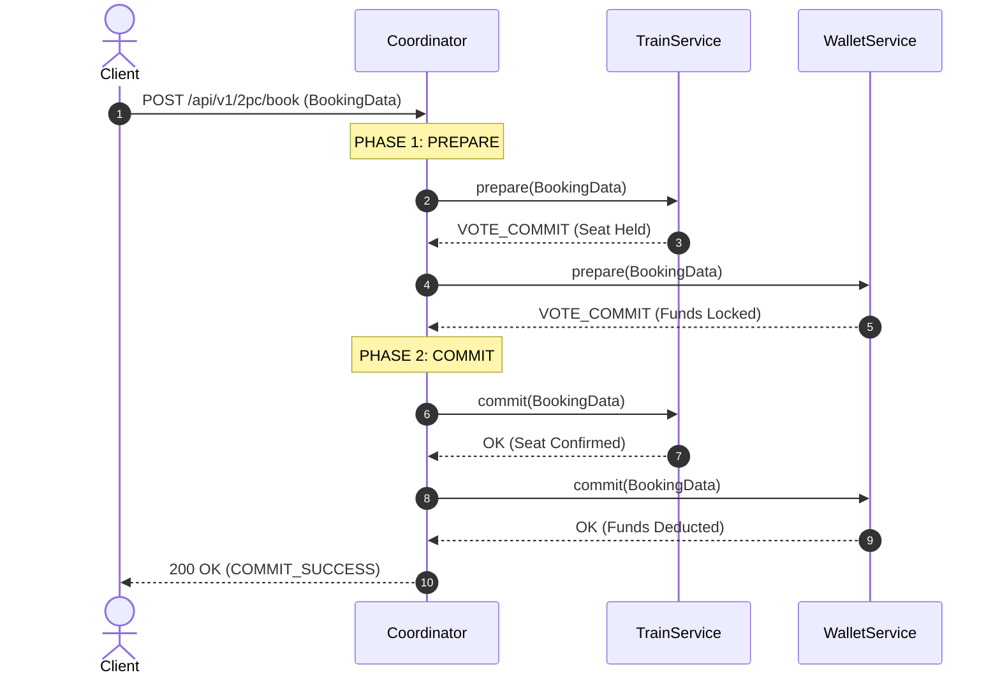
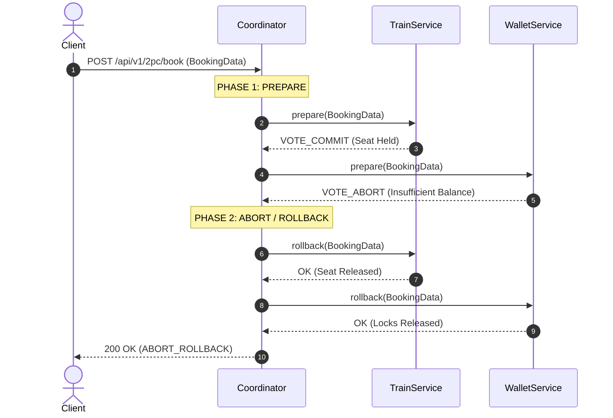

# BÀI TẬP 1: MÔ PHỎNG GIAO THỨC TWO-PHASE COMMIT (2PC) CHO HỆ THỐNG ĐẶT VÉ TÀU

## 1. TỔNG QUAN VỀ GIAO THỨC TWO-PHASE COMMIT (2PC)
Giao thức Two-Phase Commit (2PC) là một giao thức phân tán nguyên tử (Atomic Distributed Transaction Protocol) nhằm đảm bảo tất cả các node/microservices tham gia vào giao dịch cùng đồng ý **COMMIT** (Ghi nhận) hoặc **ABORT/ROLLBACK** (Hủy bỏ) dữ liệu.

Trong bài tập này, Coordinator quản lý giao dịch 2PC đặt vé tàu giữa 2 microservices:
1. **`TrainService`**: Quản lý việc giữ chỗ và xác nhận vé tàu.
2. **`WalletService`**: Quản lý việc khóa số dư và trừ tiền tài khoản người dùng.

---

## 2. MÃ GIẢ (PSEUDOCODE) HÀM `coordinator(bookingData)`

```text
FUNCTION coordinator(bookingData):
    // -------------------------------------------------------------------
    // PHASE 1: PREPARE PHASE (Voting Phase)
    // -------------------------------------------------------------------
    LOG "Phase 1: Sending PREPARE requests to TrainService and WalletService"
    
    trainVote  = TrainService.prepare(bookingData)    // Returns VOTE_COMMIT or VOTE_ABORT
    walletVote = WalletService.prepare(bookingData)   // Returns VOTE_COMMIT or VOTE_ABORT
    
    // -------------------------------------------------------------------
    // PHASE 2: COMMIT OR ABORT PHASE (Decision & Execution Phase)
    // -------------------------------------------------------------------
    IF (trainVote == VOTE_COMMIT AND walletVote == VOTE_COMMIT) THEN
        LOG "Phase 2: Global Decision = COMMIT"
        TRY:
            TrainService.commit(bookingData)
            WalletService.commit(bookingData)
            RETURN Response(STATUS_SUCCESS, "Global Commit Executed")
        CATCH Exception e:
            // Emergency Rollback in case of system failure
            TrainService.rollback(bookingData)
            WalletService.rollback(bookingData)
            RETURN Response(STATUS_ABORT, "Global Abort Executed due to commit failure")
        END TRY
    ELSE
        LOG "Phase 2: Global Decision = ABORT"
        TrainService.rollback(bookingData)
        WalletService.rollback(bookingData)
        RETURN Response(STATUS_ABORT, "Global Abort Executed: One or more services voted ABORT")
    END IF
END FUNCTION
```

---

## 3. SƠ ĐỒ LUỒNG NGUYÊN LÝ 2PC

### A. Luồng Thành Công (Global Commit)


### B. Luồng Thất Bại & Rollback (Global Abort)


---

## 4. PHÂN TÍCH ƯU VÀ NHƯỢC ĐIỂM CỦA 2PC

| Tiêu chí | Mô tả phân tích |
| :--- | :--- |
| **Ưu điểm** | - **Đảm bảo tính nhất quán cao (Strong Consistency / ACID)** giữa các dịch vụ phân tán.<br>- Đơn giản về mặt tư duy dữ liệu (các tài nguyên được khóa lại trước khi commit). |
| **Nhược điểm** | 1. **Vấn đề nghẽn tài nguyên (Blocking Problem)**: Trong Phase 1, các tài nguyên (ghế tàu, số dư tiền) bị khóa cho đến khi Phase 2 hoàn tất. Nếu network trễ, các transaction khác sẽ bị block.<br>2. **Single Point of Failure (SPOF)**: Nếu Coordinator bị hỏng (crash) giữa Phase 1 và Phase 2, các participant microservices sẽ bị treo ở trạng thái chờ không biết nên Commit hay Abort.<br>3. **Hiệu năng thấp (Low Throughput / Performance Overhead)**: Giao tiếp đồng bộ (Synchronous RPC) trải qua 2 round-trips làm tăng latency đáng kể. |

---

## 5. HƯỚNG DẪN CHẠY VÀ KIỂM THỬ

### A. Chạy ứng dụng
```bash
./gradlew bootRun
```

### B. Kiểm thử qua REST API Endpoint
- **API Đặt vé thành công**: `GET http://localhost:8080/api/v1/2pc/demo/success`
- **API Đặt vé thất bại do không đủ tiền**: `GET http://localhost:8080/api/v1/2pc/demo/abort-wallet`
- **API Đặt vé thất bại do ghế đã bị đặt**: `GET http://localhost:8080/api/v1/2pc/demo/abort-train`

### C. Chạy Unit Test
```bash
./gradlew test
```
